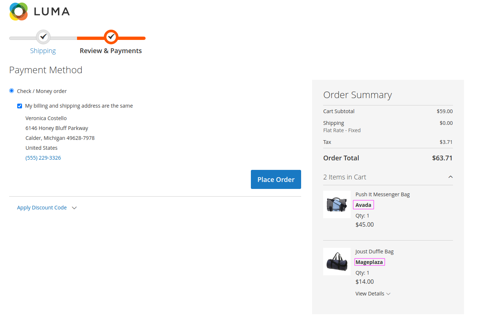

Setup **manufacturer** Attribute in Magento Admin then

Clone This Code and run command

php bin/magento setup:upgrade

php bin/magento setup:di:compile

php bin/magento setup:static-content:deploy -f

php bin/magento cache:flush

And this is Result:

